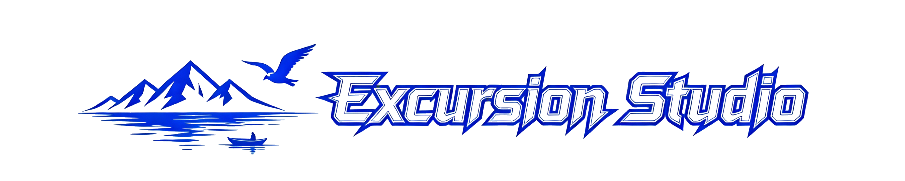

  

  English Version | <a href="README_zh.md">中文版</a>

  <strong>🎯 A modern, interactive, and data-driven studio platform</strong> 
  <em>Soaring through the high sky by wind, Looking down the vast rivers and mountains.</em>

---

## 🌐 Visit

**🔗 [https://excursion-studio.github.io/](https://excursion-studio.github.io/)**

The site automatically redirects to the Chinese version by default. Use the language switcher in the navigation bar to toggle between English and Chinese.

---

## 🔬 Research

| Research Area | Status | Description |
|---------------|--------|-------------|
| Foundation of Navigation and Planning | 🔬 Active | Including State Estimation, SLAM, Planning and Policy, and Control |

---

## 🎁 Products

### Research-related Page Templates Series

| Product | Status | Link |
|---------|--------|------|
| Excursion Studio Personal Homepage Ver.2 (ESPH-V2) | ✅ Available | [Preview](https://excursion-studio.github.io/Personal-Homepage-Template-v2/) |
| Excursion Studio Research Project Page (ESRPP) | ✅ Available | [Preview](https://excursion-studio.github.io/Research-Project-Page-Template/) |
| Excursion Studio Personal Homepage (ESPH) **(Outdated)** | ✅ Available | [Preview](https://excursion-studio.github.io/Personal-Homepage-Template/) |

---

## 🎯 Vision

> **Building a studio has always been the dream of the proprietor, and the proprietor will try his best to make it come true!**

Excursion Studio aims to create a **more interactive and fashionable platform** that provides a **comfortable environment** for visitors interested in the studio's **work, facilities, and products**.

While currently in BETA with limited resources, the vision is to gradually build a fully-equipped research studio. Stay tuned as the studio continues to fill this platform with valuable content!

---

  Built by Excursion Studio | © 2026

